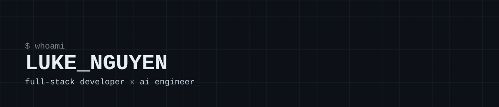

<div align="center">




</div>

<br/>

```bash
$ cat philosophy.txt
good backend architecture is invisible — nobody notices it, it just doesn't break.
good AI products don't feel like "AI" — they just feel obviously right.

$ ps aux | grep "currently building"
luke   ai-agent-pipeline    node/nestjs + langchain + pgvector
luke   internal-rag-search  retrieval-augmented answers over private docs
```

<br/>

### `$ cat stack.json`

```json
{
  "backend":   ["Node.js", "NestJS", "Express", "PostgreSQL"],
  "ai_ml":     ["LangChain", "OpenAI API", "RAG pipelines", "pgvector", "Python"],
  "frontend":  ["React", "TypeScript"],
  "tooling":   ["Docker", "Git", "GitHub Actions"]
}
```

<br/>

### `$ ls ~/projects --featured`

| project | what it does | stack |
|---|---|---|
| [project-one](https://github.com/Chuki1234/project-one) | one-line description of the problem it solves | `nestjs` `postgresql` |
| [project-two](https://github.com/Chuki1234/project-two) | e.g. RAG chatbot over internal docs, citation-grounded answers | `langchain` `openai` `node.js` |
| [project-three](https://github.com/Chuki1234/project-three) | one-line description | `react` `typescript` |

> Swap these for your real repos, then pin them via **your profile → Customize your pins**.

<br/>

### `$ github --stats`

<div align="center">


</div>

<br/>

### `$ ./contribution-snake.sh`

<div align="center">

<picture>
  <source media="(prefers-color-scheme: dark)" srcset="https://raw.githubusercontent.com/Chuki1234/Chuki1234/output/github-contribution-grid-snake-dark.svg" />
  <source media="(prefers-color-scheme: light)" srcset="https://raw.githubusercontent.com/Chuki1234/Chuki1234/output/github-contribution-grid-snake.svg" />
  
</picture>

*(hiện ra sau khi GitHub Action `snake.yml` chạy lần đầu — xem hướng dẫn setup)*

</div>

<br/>

```bash
$ cat quote.txt
"ship the boring 90%, so the 10% that's actually AI can be trusted."

$ contact --show
email    ntloc124@gmail.com
```

